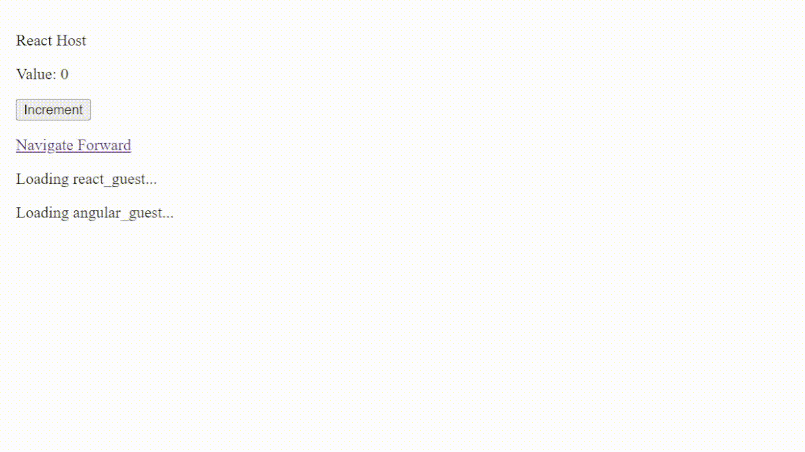

# Microfrontends Example

This repository is a detailed example of how microfrontends can be implemented and integrated at runtime via JavaScript. The solution was originally inspired by [Cam Jackson's article](https://martinfowler.com/articles/micro-frontends.html).

## Terminology

A _host_ is a frontend application that contains and renders microfrontends.

A _guest_ is a microfrontend application that can be rendered within a host or in a standalone application.

## Introduction

In this example, the host is implemented with React, but the solution is framework-agnostic and can be implemented with vanilla JavaScript or with any frontend framework. For demonstration purposes, the host integrates two guests. A React guest, and an Angular guest. Both the host and the guests are fully rendered at the client.



## Implementing Guests

You can implement a guest with vanilla JavaScript or with any frontend framework of your choice as long as you export a function that mounts your microfrontend under a given HTML element.

For example, `react-guest/src/app.tsx` is an entry point for our React microfrontend and our goal is to render it on the host.

In `react-guest/src/main.tsx`, we export a function `mountMicrofrontend` to render the `App` component under a given element `root`.

```tsx
// react-guest/src/main.tsx
export function mountMicrofrontend(root: HTMLElement) {
  createRoot(root).render(
    <StrictMode>
      <App />
    </StrictMode>
  );
}
```

To let our guest run as a standalone application as well, we will add an if-statement that checks whether an element with an ID equal to `react-guest` exists in the DOM or not. If it exists, then we are running as a standalone application because we know that the host cannot have an element with this ID by convention.

```tsx
// react-guest/src/main.tsx
export function mountMicrofrontend(root: HTMLElement) {
  // ...
}

const root = document.getElementById("react-guest");

if (root) {
  mountMicrofrontend(root);
}
```

Implementing an Angular guest is similar to this. Feel free to look at `angular-guest/` for an example.

## Implementing a Host

### Rendering Microfrontends

Our goal at the host is to dynamically import the mounting functions (i.e., `mountMicrofrontend`) and call them for each microfrontend that we want to render.

In our React implementation, we will handle this in the `react-host/src/microfrontend.tsx` component which takes the microfrontend's JavaScript source as a prop.

```tsx
<Microfrontend src="http://localhost:5174/src/main.tsx" />
```

Initially, this component renders an empty `div` element. When it renders, we will dynamically import the given JavaScript source and pass the `div` element to the exported `mountMicrofrontend` function.

```tsx
// react-host/src/microfrontend.tsx
export function Microfrontend({ src }: MicroFrontendProps) {
  const ref = useRef<HTMLDivElement>(null);

  useEffect(() => {
    import(src).then(({ mountMicrofrontend }) => {
      mountMicrofrontend(ref.current);
    });
  }, [src]);

  return <div ref={ref}></div>;
}
```

Since the dynamic import is asynchronous, it is possible for it to be running even after the `Microfrontend` component has unmounted. To workaround that issue, we will ignore the dynamic import by not calling the `mountMicrofrontend` function if the component gets unmounted.

```tsx
// react-host/src/microfrontend.tsx
useEffect(() => {
  let ignore = false;

  import(src).then(({ mountMicrofrontend }) => {
    if (!ignore) {
      mountMicrofrontend(ref.current);
    }
  });

  return () => {
    ignore = true;
  };
}, [src]);
```

This is the base implementation, feel free to look at the `Microfrontend` implementation provided in this repository for handling loading and errors.

## Implementing Cross-Application Communication

Cross-application communication is implemented by dispatching and listening for custom events.

Suppose that we have a stateful `value` in our host, and we want to share it with our guests.

```tsx
// react-host/src/app.tsx
function App() {
  const [value, setValue] = useState(0);

  // ...
}
```

To increment the `value`, we will dispatch a custom event named `increment` containing the incremented value.

```tsx
// react-host/src/app.tsx
function App() {
  const [value, setValue] = useState(0);

  function increment() {
    const event = new CustomEvent("increment", { detail: value + 1 });
    window.dispatchEvent(event);
  }

  // ...
}
```

Notice that the `increment` function does not use `setValue` to update the state, it only dispatches an event on the `window` object. To update the state, we will attach a listener that listens for the `increment` event and updates the `value` with `setValue`.

```tsx
// react-host/src/app.tsx
function App() {
  const [value, setValue] = useState(0);

  useEffect(() => {
    const controller = new AbortController();
    const { signal } = controller;

    window.addEventListener(
      "increment",
      (event) => setValue((event as CustomEvent).detail),
      { signal }
    );

    return () => controller.abort();
  }, []);

  function increment() {
    const event = new CustomEvent("increment", { detail: value + 1 });
    window.dispatchEvent(event);
  }

  // ...
}
```

This approach establishes a two-way communication channel. Guests can also listen for and increment the `value` by dispatching the `increment` event using the same technique described above.

That is it when it comes to cross-application communication. Now, whenever the state changes reactively, both the host and guests have a copy of the same `value`.
